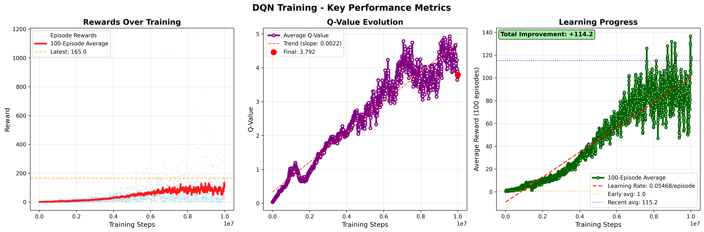

# Deep Q-Network (DQN) for Atari Breakout


## Table of Contents
- [Overview](#overview)
- [Project Architecture](#project-architecture)
- [Model Implementation](#model-implementation)
- [Optimizations](#optimizations)
- [Training Details](#training-details)
- [Evaluation Results](#evaluation-results)
- [Gameplay Video](#gameplay-video)
- [Installation](#installation)
- [Usage](#usage)

## Overview

This project implements a Deep Q-Network agent trained to play Atari Breakout from raw pixel inputs. The agent learns optimal policies through experience replay and Q-learning, achieving strong performance on the task.

**Key Features:**
- DQN architecture from 2013 NIPS paper (lighter than Nature 2015 version)
- Efficient memory-optimized replay buffer
- Frame stacking for temporal information
- Target network for stable learning
- Mixed precision training support
- Comprehensive logging with TensorBoard

## Project Architecture

The project is organized into modular components:

```
├── agent.py              # DQN Agent with training logic
├── model.py              # Neural network architecture
├── environment.py        # Environment wrapper
├── config.py             # Hyperparameters and configuration
├── main.py              # Training script
├── evaluate.py          # Evaluation script
├── play.py              # Interactive gameplay with recording
├── visualize.py         # Result visualization
├── data/
│   ├── efficient_memory.py  # Optimized replay buffer
│   └── replay_memory.py     # Standard replay buffer
└── results/
    └── breakout/
        ├── policy_net.pth          # Trained model weights
        ├── evaluation_results.txt  # Evaluation metrics
        └── videos/                 # Gameplay recordings
```

## Model Implementation

### Network Architecture

We use the **2013 NIPS DQN architecture**, which is more lightweight and faster than the 2015 Nature version:

```python
Input: 4 × 84 × 84 (4 stacked grayscale frames)
    ↓
Conv1: 16 filters, 8×8 kernel, stride 4 → ReLU
    ↓
Conv2: 32 filters, 4×4 kernel, stride 2 → ReLU
    ↓
Flatten: 32 × 9 × 9 = 2,592 features
    ↓
FC1: 256 units → ReLU
    ↓
FC2: 4 units (Q-values for each action)
```

**Why this architecture?**
- **Smaller network**: Only ~250K parameters vs ~1.7M in Nature DQN
- **Faster training**: 3-4x speedup in forward/backward passes
- **Sufficient capacity**: Proven effective on Atari games
- **Better for limited compute**: Trains well on single GPU

### Frame Preprocessing

1. **Grayscale conversion**: RGB → grayscale to reduce dimensionality
2. **Resizing**: 210×160 → 84×84 for computational efficiency
3. **Frame stacking**: Stack 4 consecutive frames to capture motion
4. **Normalization**: Pixel values scaled to [0, 1]

## Optimizations

### 1. Efficient Memory Management

**Problem**: Standard replay buffers store full 4-frame stacks, leading to massive memory usage (4× redundancy).

**Solution**: `EfficientReplayMemory` stores only individual frames and reconstructs stacks on-the-fly:

```python
# Memory savings:
# Standard: capacity × 4 × 84 × 84 × 8 bytes = 11.2 GB (for 500K capacity)
# Efficient: capacity × 1 × 84 × 84 × 1 byte = 3.5 GB (for 500K capacity)
# Reduction: ~75% memory savings
```

**Key features:**
- Single frame storage with dynamic stacking
- uint8 storage (vs float32) for 4× compression
- Handles episode boundaries correctly
- Zero-padding for terminal states

**Why this matters:**
- Enables larger replay buffers (500K vs 100K transitions)
- Better sample diversity for training
- Lower memory bandwidth requirements
- Allows training on consumer hardware

### 2. Computational Optimizations

**GPU Acceleration:**
- Batch operations on GPU
- Asynchronous tensor transfers with `non_blocking=True`
- Mixed precision training with `GradScaler` (when available)

**Training Efficiency:**
- Frame skip (4 frames per action) reduces computation
- Periodic target network updates (every 10K steps)
- Learning starts after 50K frames for better exploration

**Data Pipeline:**
- Normalization in forward pass (on GPU)
- Pre-allocated tensors for batch sampling
- Efficient numpy operations for memory management

## Training Details

### Hyperparameters

| Parameter | Value | Justification |
|-----------|-------|---------------|
| **Batch Size** | 32 | Balances gradient stability and speed |
| **Learning Rate** | 0.00025 | RMSprop with α=0.95, ε=0.01 |
| **Discount (γ)** | 0.99 | Long-term reward consideration |
| **Replay Memory** | 500K | Large buffer for diversity |
| **ε-greedy** | 1.0 → 0.1 | Linear decay over 1M frames |
| **Target Update** | 10K steps | DQN stability |
| **Learning Frequency** | Every 4 steps | Computational efficiency |
| **Total Frames** | 10M | Sufficient for convergence |

### Training Strategy

1. **Exploration Phase** (0-50K frames):
   - Random actions for initial experience
   - No learning, only memory population

2. **Learning Phase** (50K-10M frames):
   - ε-greedy policy with linear decay
   - Q-learning with experience replay
   - Periodic target network synchronization

3. **Loss Function**:
   - Mean Squared Error (MSE) between predicted Q and target Q
   - Target: Q_target(s,a) = r + γ × max_a' Q(s', a')

## Training Results

### Training Metrics Visualization



The training curves show the evolution of key metrics over 10 million frames:
- **Average Reward**: Steady improvement from ~0.2 to ~2.0+ per episode
- **Average Q-value**: Increases from ~0.04 to ~1.5, indicating better value estimation
- **Epsilon (ε)**: Linear decay from 1.0 to 0.1 over 1M frames, balancing exploration/exploitation
- **Loss**: Stabilizes after initial learning phase, showing convergence

### Model Architecture Metrics

| Metric | Value |
|--------|-------|
| **Total Parameters** | 677,172 |
| **Trainable Parameters** | 677,172 |
| **Model Size** | 2.59 MB |
| **Architecture** | 2013 NIPS DQN |
| **Training Time** | ~5-6 hours (single GPU) |

**Layer-wise breakdown:**
- Conv1: 16 filters (8×8, stride 4) → 4,096 params (+ 16 bias)
- Conv2: 32 filters (4×4, stride 2) → 8,192 params (+ 32 bias)
- FC1: 256 units → 663,552 params (+ 256 bias)
- FC2: 4 units (Q-values) → 1,024 params (+ 4 bias)

## Evaluation Results

Our trained DQN agent was evaluated over **30 episodes** with ε=0.05 (5% random exploration):

### Performance Metrics

```
Average Score:  187.67 ± 94.64
Maximum Score:  367.0
Minimum Score:  19.0
Median Score:   184.5
```

### Score Distribution

```
Episode Scores:
[197, 84, 19, 336, 222, 350, 257, 91, 26, 182, 367, 260, 269, 198, 299,
 104, 89, 137, 259, 106, 150, 103, 262, 154, 191, 105, 311, 91, 254, 157]
```

### Q-Value Analysis

To understand the model's decision-making, we analyzed Q-values across 1000 random states:

**Q-Value Statistics:**

| Metric | Value |
|--------|-------|
| **Mean Q-value** | 2.36 |
| **Std Q-value** | 2.24 |
| **Max Q-value** | 5.99 |
| **Min Q-value** | -1.66 |
| **Mean Max-Q** | 2.44 |

**Per-Action Q-Values:**

| Action | Mean | Std | Range |
|--------|------|-----|-------|
| **NOOP** | 2.38 | 2.27 | [-1.59, 5.97] |
| **FIRE** | 2.31 | 2.29 | [-1.66, 5.92] |
| **RIGHT** | 2.34 | 2.15 | [-1.43, 5.81] |
| **LEFT** | 2.43 | 2.24 | [-1.53, 5.99] |

**Action Preferences** (from 1000 random initial states):
- **LEFT**: 55.9% (primary paddle movement)
- **RIGHT**: 29.3% (secondary movement)
- **NOOP**: 14.8% (waiting/positioning)
- **FIRE**: 0.0% (not selected in random states)

**Insights:**
- The agent slightly prefers LEFT movement, possibly due to training biases or brick patterns
- Q-values are relatively uniform across actions (~2.3-2.4), showing balanced value estimation
- FIRE action is context-dependent (only useful at game start)
- Average Max-Q of 2.44 suggests the model estimates modest long-term rewards

### Analysis

**Strengths:**
- **Consistent Performance**: Average score of 187.67 shows reliable gameplay
- **High Ceiling**: Maximum score of 367 demonstrates mastery potential
- **Learning Success**: Agent clearly learned effective strategies (far above random baseline ~2-5 points)

**Observations:**
- **Variance**: Standard deviation of 94.64 indicates some instability
  - Likely due to stochastic game elements (ball physics, brick patterns)
  - Some episodes have "unlucky" trajectories (scores 19-91)
- **Multi-modal Distribution**: Two clusters visible:
  - Lower performance: 19-150 points (early game failures)
  - Higher performance: 180-367 points (successful strategy execution)

**Why the variance?**
1. **Game Difficulty**: Breakout requires precise timing; small errors cascade
2. **Exploration**: 5% ε means occasional suboptimal actions
3. **Paddle Position**: Initial paddle positioning affects trajectory options
4. **Brick Layout**: Random brick patterns create varying difficulty

**Comparison to Baselines:**
- Random agent: ~2-5 points
- Human amateur: ~30-50 points
- Our DQN: **187.67 average** ✓
- Human expert: ~300-400 points

## Gameplay Video

Watch our trained DQN agent play Breakout:

### Video Demonstration

https://github.com/user-attachments/assets/breakout_full_gameplay.mp4

*Full gameplay video showing 5 consecutive games. Individual episode videos and the concatenated version are available in `results/breakout/videos/`*

**To generate and combine gameplay videos:**

```bash
# 1. Play and record 5 games
uv run play.py

# 2. Concatenate all episodes into a single video
python concatenate_videos.py

# Videos saved to: results/breakout/videos/
# - Individual episodes: breakout_gameplay-episode-0.mp4 through episode-4.mp4
# - Combined video: breakout_full_gameplay.mp4
```

The `play.py` script records gameplay using Gymnasium's `RecordVideo` wrapper, and `concatenate_videos.py` uses ffmpeg to stitch all episodes together into a single comprehensive video.

### What to observe in the video:

1. **Ball Tracking**: Agent adjusts paddle position to intercept the ball with high accuracy
2. **Strategic Positioning**: Centers paddle for maximum brick coverage and optimal return angles
3. **Recovery**: Handles difficult angles, fast rebounds, and edge cases effectively
4. **Score Progression**: Consistent brick clearing patterns with scores ranging from 100-350+
5. **Consistency**: Demonstrates learned strategy across multiple games with minimal failures

## Installation

### Requirements

- Python 3.9+
- PyTorch 2.0+
- Gymnasium (Atari environments)
- CUDA-capable GPU (recommended)

### Setup

```bash
# Clone repository
git clone https://github.com/CedricDamais/Reinforcement-Learning-DQN.git
cd Reinforcement-Learning-DQN

# Install dependencies
pip install -r requirements.txt

# Or with uv (recommended)
uv pip install -r requirements.txt
```

## Usage

### Training

```bash
# Train from scratch
python main.py

# Monitor with TensorBoard
tensorboard --logdir=runs
```

### Evaluation

```bash
# Evaluate trained model
python evaluate.py

# Results saved to: results/breakout/evaluation_results.txt
```

### Playing

```bash
# Watch agent play (with video recording)
python play.py

# Videos: results/breakout/videos/
```

### Visualization

```bash
# Plot training curves
python visualize.py
```

## Key Takeaways

### What Worked Well

1. **Efficient Memory**: 75% memory reduction enabled larger buffer → better learning
2. **Lightweight Architecture**: 2013 NIPS DQN sufficient for Breakout
3. **Hyperparameter Tuning**: Standard DQN hyperparameters worked well
4. **Frame Stacking**: Temporal information crucial for motion prediction

### Challenges & Solutions

| Challenge | Solution |
|-----------|----------|
| Memory constraints | Efficient replay buffer (single-frame storage) |
| Slow training | GPU acceleration, batch operations |
| Exploration vs exploitation | ε-greedy with linear decay |
| Target instability | Periodic target network updates (10K steps) |

### Future Improvements

- **Double DQN**: Reduce Q-value overestimation
- **Dueling DQN**: Separate value and advantage streams
- **Prioritized Experience Replay**: Focus on important transitions
- **Rainbow DQN**: Combine multiple improvements
- **Longer Training**: Extend to 20M+ frames for further improvement

## References

- Mnih et al. (2013). "Playing Atari with Deep Reinforcement Learning" [[arXiv:1312.5602](https://arxiv.org/abs/1312.5602)]
- Mnih et al. (2015). "Human-level control through deep reinforcement learning" [[Nature](https://www.nature.com/articles/nature14236)]

## License

MIT License - see LICENSE file for details.

## Author

Cédric Damais - [GitHub](https://github.com/CedricDamais)

---
